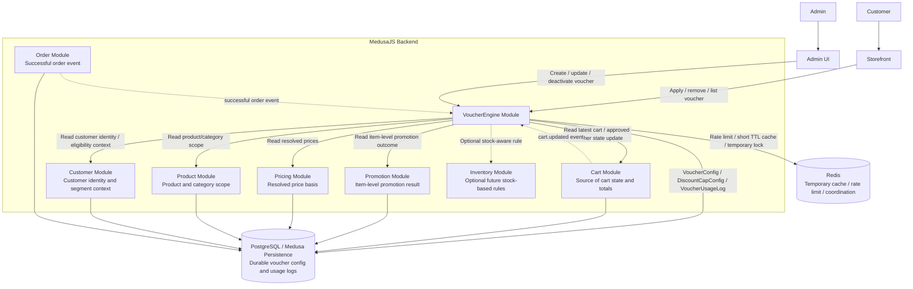

# D-01. VoucherEngine Module Interaction Diagram

## Purpose

Show how VoucherEngine interacts with MedusaJS core modules, Redis, and durable persistence while preserving ownership boundaries.

## Related Solution Sections

- 3. Solution Context
- 3.2 Source-of-Truth Rules
- 4. Module Responsibility and Boundaries
- 14. Module Interaction Map
- 16. Redis Coordination and Cache Policy
- 17. Technical Design Inputs for Future SPEC Generation

## Mermaid Diagram

## Interpretation

VoucherEngine coordinates voucher validation, discount decision, cap enforcement, and redemption audit. It does not own cart items, product data, item-level promotions, prices, order lifecycle, or inventory quantities.

Redis is a temporary support layer only. It may help with rate limiting, short-lived cache, and coordination, but final cart state, final cart totals, voucher configuration, redemption count, and usage logs must remain durable and authoritative outside Redis.

## SPEC Generation Notes

The future `SPEC.md` must inspect the current MedusaJS project before deciding:

- how active voucher state is associated with Cart;
- where cart totals are recalculated;
- how Promotion/Pricing expose item-level promotion results;
- which event names and payloads are available;
- whether Link Module should be used for product/category scoping;
- which operations need workflows, subscribers, links, or service calls.
