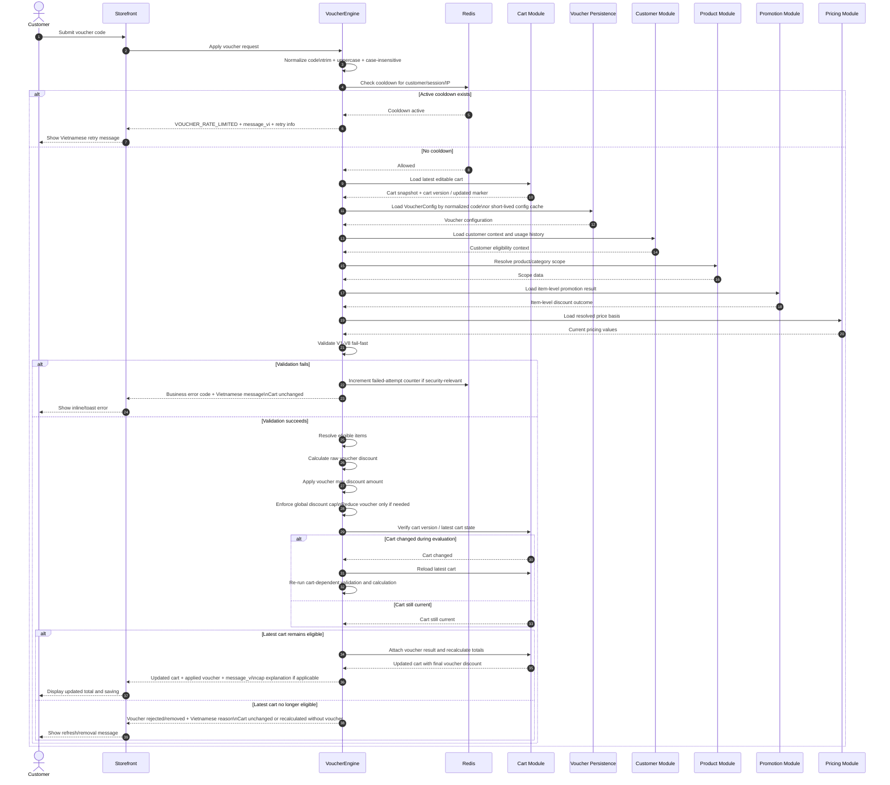

# D-02. Apply Voucher Sequence Diagram

## Purpose

Show the end-to-end flow from voucher submission to updated cart response, including Redis cooldown, fail-fast validation, discount calculation, global cap enforcement, stale-cart protection, and Vietnamese customer response.

## Related Solution Sections

- 7.1 Apply New Voucher
- 7.7 Concurrent Cart and Voucher Operations
- 7.8 Voucher Attempt Protection
- 8. Voucher Validation Flow
- 9. Discount Resolution Flow
- 11. Error and Decision Contract
- 12. Language and Customer Messaging Policy
- 16. Redis Coordination and Cache Policy
- 18. Exception and Error Handling Contract

## Mermaid Diagram

## Interpretation

Voucher application is finalized only after validation, discount calculation, global-cap check, and latest-cart verification succeed. A failed validation or calculation must leave the cart unchanged. If the cart changes during evaluation, the outdated calculation result is discarded and the latest cart must be re-evaluated.

## SPEC Generation Notes

The future `SPEC.md` must define:

- Store API entry point for apply voucher;
- request/response DTOs;
- validation sequence and error mapping;
- Redis failed-attempt/cooldown keys and TTL;
- source of cart version or concurrency marker;
- source of promotion and pricing results;
- cart update/recalculation strategy;
- rollback behavior if calculation fails;
- Vietnamese message response shape.
