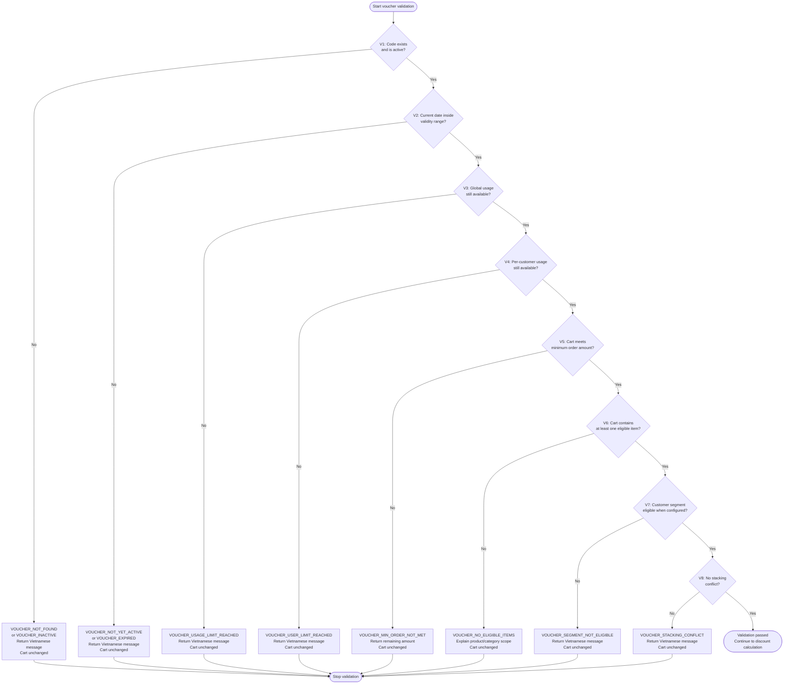

# D-03. Voucher Validation Decision Flowchart

## Purpose

Show fail-fast voucher validation from V1 to V8. Each failed validation returns one stable business error code and one Vietnamese customer-facing message.

## Related Solution Sections

- 7.1 Apply New Voucher
- 7.8 Voucher Attempt Protection
- 8. Voucher Validation Flow
- 10. Business Rules to Preserve
- 11. Error and Decision Contract
- 12. Language and Customer Messaging Policy
- 18. Exception and Error Handling Contract

## Mermaid Diagram

## Interpretation

Validation must stop at the first failed rule. The system must return one clear failure reason and must not continue to later checks. This avoids confusing multi-error responses and reduces unnecessary disclosure of voucher details.

## SPEC Generation Notes

The future `SPEC.md` must define:

- validation function/service responsibility;
- exact error code constants;
- Vietnamese default messages;
- metadata for dynamic values such as remaining amount or expiry date;
- which failures increment Redis failed-attempt counters;
- whether V7 segment validation is active or deferred;
- unit tests for every validation branch.
