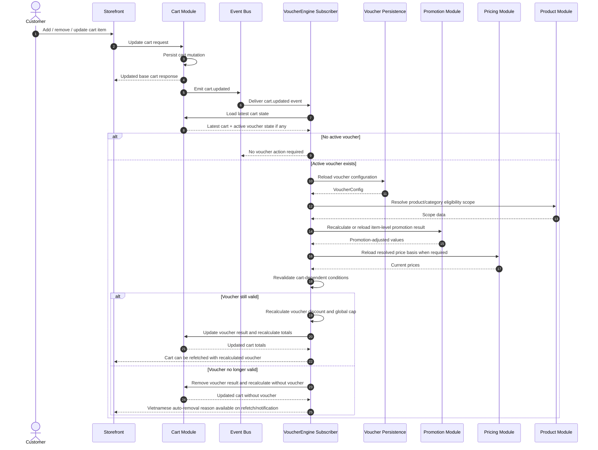

# D-05. Cart Change Revalidation Sequence Diagram

## Purpose

Show how VoucherEngine reacts when the cart changes after a voucher has already been applied. The voucher may remain applied with recalculated discount, or it may be automatically removed.

## Related Solution Sections

- 7.4 Revalidate Voucher After Cart Change
- 7.7 Concurrent Cart and Voucher Operations
- 9. Discount Resolution Flow
- 10. Business Rules to Preserve
- 13. Data State Changes
- 18. Exception and Error Handling Contract

## Mermaid Diagram

## Interpretation

Voucher eligibility is dynamic and depends on the latest cart state. After every cart update, an active voucher must be revalidated. If still valid, discount is recalculated. If invalid, the voucher is automatically removed and the customer must receive a Vietnamese reason.

## SPEC Generation Notes

The future `SPEC.md` must define:

- exact cart update event name and payload;
- subscriber file/registration plan;
- how active voucher state is detected on cart;
- how the storefront sees async recalculation results;
- whether MVP uses refetch/polling or push notification;
- idempotency behavior if the same cart.updated event is processed more than once;
- integration tests for eligible item removal, min order drop, and promotion tier changes.
