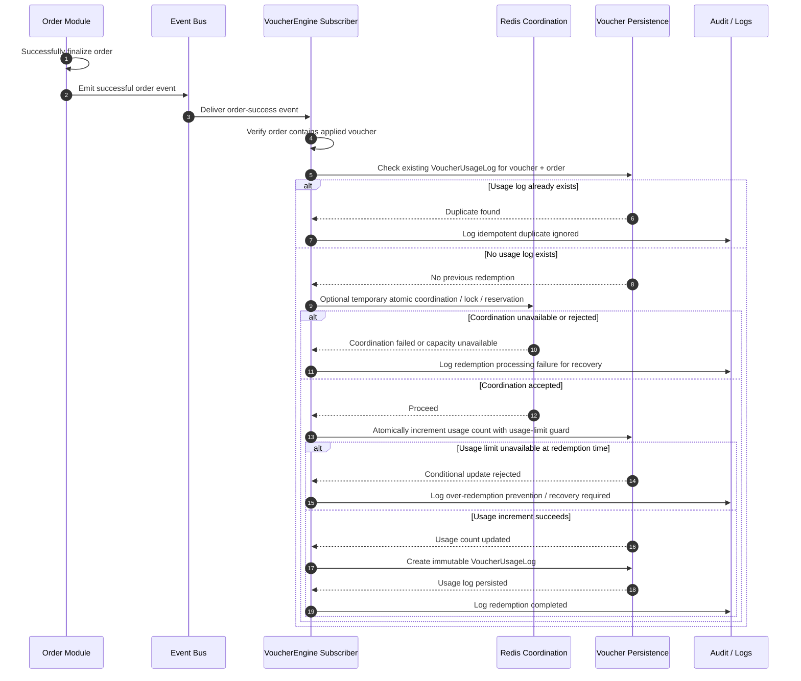

# D-06. Voucher Usage Recording Sequence Diagram

## Purpose

Show voucher redemption recording only after successful order placement. Applying a voucher to cart is not redemption. Successful order placement is redemption.

## Related Solution Sections

- 6. Voucher Lifecycle Overview
- 7.5 Record Voucher Usage After Successful Order Placement
- 10. Business Rules to Preserve
- 13. Data State Changes
- 17. Technical Design Inputs for Future SPEC Generation
- 18. Exception and Error Handling Contract
- 21. Risks and Pending Decisions

## Mermaid Diagram

## Interpretation

Voucher usage count and VoucherUsageLog are created only after successful order placement. Usage recording must be idempotent and atomic. The same order event must not increment usage count more than once. Multiple concurrent successful orders must not exceed global or per-customer usage limits.

## SPEC Generation Notes

The future `SPEC.md` must define:

- exact successful order event name and payload;
- idempotency key or unique constraint strategy;
- atomic usage-count strategy;
- transaction boundary for increment + usage log creation;
- Redis coordination role, if used;
- failure recovery when order succeeded but voucher usage recording failed;
- event/subscriber tests for duplicate event delivery;
- concurrency tests near usage limit.
