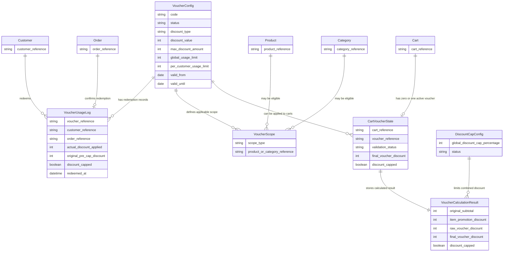

# D-07. Conceptual Voucher Domain Relationship Diagram

## Purpose

Show conceptual business relationships for VoucherEngine without defining database schema, ORM decorators, migrations, or exact implementation files.

## Related Solution Sections

- 3.2 Source-of-Truth Rules
- 4. Module Responsibility and Boundaries
- 6. Voucher Lifecycle Overview
- 13. Data State Changes
- 17.6 Required Relationship and Link Decisions
- 21. Risks and Pending Decisions

## Mermaid Diagram

## Interpretation

This diagram is conceptual. It shows business relationships, not final persistence design. The future `SPEC.md` must decide whether relationships are implemented through MedusaJS Link Module, stored references, separate scope records, read-only query references, or a combination.

VoucherUsageLog must remain immutable and historically valid even if voucher configuration, product category, or customer data changes later.

## SPEC Generation Notes

The future `SPEC.md` must decide:

- how VoucherConfig relates to Product and Category scope;
- how active voucher state is associated with Cart;
- whether CartVoucherState is persisted or represented through approved cart extension;
- how VoucherUsageLog references Customer and Order;
- whether product/category snapshots are needed for audit;
- which relationships use Link Module;
- which references remain read-only and must not mutate core module data.
